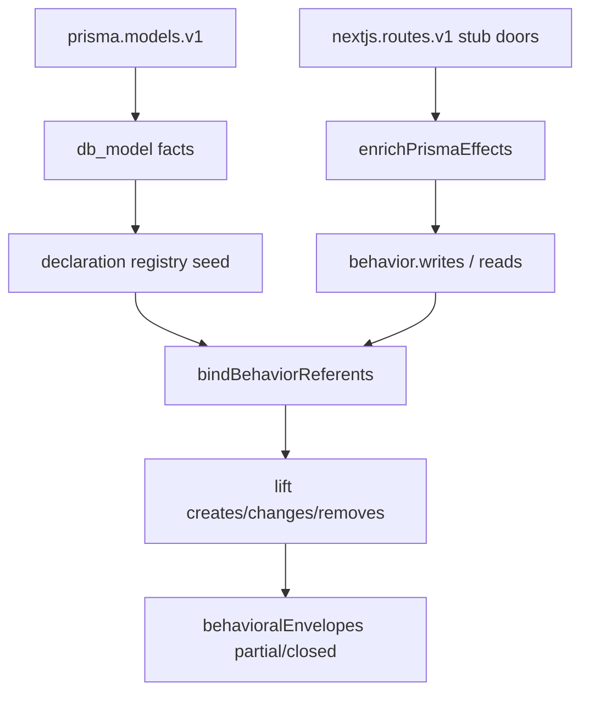

# Papermark Resource/Effect Binding — Implementation Plan

> **For agentic workers:** REQUIRED SUB-SKILL: Use superpowers:subagent-driven-development (recommended) or superpowers:executing-plans to implement this plan task-by-task. Steps use checkbox (`- [ ]`) syntax for tracking.

**Goal:** Close a few real Papermark-class SaaS envelopes by binding Next.js API terminals to named Prisma Resources (`creates`/`changes`/`removes` Document, Dataroom, …), moving them from `open` to `partial`/`closed`.

**Architecture:** Keep the kernel envelope projection unchanged. Ship a Prisma `db_model` inventory, seed those models into the declaration registry without Python AST, then enrich Next.js stub-door behaviors with bounded Prisma-call effects discovered in the same route file. UI→API joins from the mechanism→envelope spine stay as-is; this slice only fills thin terminals.

**Tech Stack:** Node ESM, tree-sitter (tsx already available), existing System Model lift/bindings/envelopes. Base on `feature/mechanism-envelope-spine` (Next.js routes + stub doors). No new runtime deps.

**Depends on:** `feature/mechanism-envelope-spine` merged or branched from (Next `api_route` + stub doors + concrete→patterned UI bind).

**Dogfood target:** Papermark (`pages/api` + `app/**/route.ts` + `prisma/schema/*.prisma`).

---

## Why this slice

```text
UI action → invokes → API operation → ??? → Resource effect
                                         ^
                                         thin today = envelopes stay open
```

Spine results on Papermark: ~274 operations, ~109 paths, ~93 envelopes — mostly `open` because stub doors have empty `reads`/`writes`. Region work stays deferred until envelopes are credible beyond UI→API joins (acceptance corpus finding #4/#5).

## Explicit non-goals

- Region promotion / Observed Areas polish
- Roadmap §3 analyzer-contract refactor
- Khoj nested-stack web UI scanning
- Full TypeScript value-flow tracer (mirroring Python `value-flow.js`)
- Following Prisma calls through `lib/**` helpers / application-operation hop
- Inventing Resources from REST path segments alone
- Closing all 93 Papermark envelopes

## Approach (chosen)

**Bounded same-file Prisma-call enrichment** — not a full TS tracer, not regex-only.

| Stage | What |
|---|---|
| 1. Inventory | `prisma.models.v1` extracts `model Name {` from `*.prisma` → `db_model` facts |
| 2. Registry | Declaration registry seeds persisted declarations from `db_model` observations even when no Python class AST exists |
| 3. Effects | For Next stub-door behaviors (`handler: null`), parse the route file once and classify `prisma.<delegate>.<op>(…)` calls against known models |
| 4. Lift | Existing `bindBehaviorReferents` + `liftSystemModel` emit reference effect Claims → envelopes gain `primarySubjectIds` |



### Prisma effect map (v1)

| Call | Relation | Notes |
|---|---|---|
| `create`, `createMany`, `upsert` | `creates` | `upsert` counts as create for subject presence; refine later if needed |
| `update`, `updateMany` | `changes` | |
| `delete`, `deleteMany` | `removes` | |
| `findUnique`, `findFirst`, `findMany`, `count`, `aggregate`, `groupBy` | `reads` | supporting only |
| `$transaction`, `$executeRaw`, `$queryRaw`, `$connect`, `$disconnect` | skip / `mechanism` | never primary subject |

Delegate → model: build `Map` from each `db_model` name to camelCase (`Document` → `document`, `UserTeam` → `userTeam`). Unknown delegates stay unresolved (do not guess).

### False-positive guards

- No `db_model` / no matching delegate → no invented entity from `/documents` path.
- Auth `prisma.userTeam.findUnique` → `reads UserTeam` only (supporting); does not close envelopes by itself.
- Dynamic `prisma[model].create` / variable delegate → leave unresolved; never resolve by filename.
- Test/mock Prisma clients: only classify member access whose object text is a known client ident (`prisma`, `db` when typed/imported from prisma module — v1: identifier `prisma` or `db` **and** file imports `@prisma/client` or `**/prisma`).

---

## File map

| File | Role |
|---|---|
| Create `src/scanners/extractors/prisma.js` | `model Name {` → `db_model` |
| Modify `src/scanners/extractor-registry.js` | register `prisma.models.v1` on `prisma` stack |
| Modify `src/scanners/stack-detect.js` | detect `prisma` via `@prisma/client` / `prisma/` schema files |
| Modify `src/system-model/coverage.js` | capability entry for prisma extractor |
| Modify `src/scanners/lift/declarations.js` | seed declarations from orphan `db_model` observations |
| Create `src/scanners/behaviors/prisma-effects.js` | classify Prisma calls in a TS/JS tree |
| Modify `src/scanners/behaviors/index.js` | enrich stub doors after Python handler loop |
| Modify `src/scanners/cache.js` | bump `EXTRACTOR_VERSION` |
| Create `test/fixtures/prisma-dataroom-create/` | minimal Next+Prisma vertical slice |
| Create `test/extractors/prisma.test.js` | inventory unit tests |
| Create `test/behaviors/prisma-effects.test.js` | call classification tests |
| Create `test/system-model/prisma-resource-binding.test.js` | UI→API→Resource envelope gate |
| Create `docs/superpowers/specs/2026-07-22-papermark-resource-effect-binding.md` | acceptance + dogfood notes |

---

### Task 1: Prisma model inventory extractor

**Files:**
- Create: `src/scanners/extractors/prisma.js`
- Modify: `src/scanners/extractor-registry.js`
- Modify: `src/scanners/stack-detect.js`
- Modify: `src/system-model/coverage.js` (add `prisma.models.v1` capabilities mirroring sqlalchemy entity coverage)
- Modify: `src/scanners/cache.js` (`EXTRACTOR_VERSION` 23→24 or current+1; comment: Prisma models)
- Test: `test/extractors/prisma.test.js`

- [ ] **Step 1: Write the failing extractor test**

```js
import assert from "node:assert/strict";
import path from "node:path";
import test from "node:test";
import { extract, modelNamesFromPrisma } from "../../src/scanners/extractors/prisma.js";
import { createScanContext } from "../../src/scanners/context.js";

test("extracts models from multi-file prisma schema folder", async () => {
  const repo = path.resolve("test/fixtures/prisma-dataroom-create");
  const files = [
    "prisma/schema/schema.prisma",
    "prisma/schema/document.prisma",
    "prisma/schema/dataroom.prisma",
  ];
  const facts = await extract(repo, files, createScanContext(repo));
  const names = new Set(facts.filter((f) => f.kind === "db_model").map((f) => f.name));
  assert.ok(names.has("Document"));
  assert.ok(names.has("Dataroom"));
  assert.equal(names.has("datasource"), false);
});

test("camelCase delegate map matches Prisma client naming", () => {
  assert.equal(modelNamesFromPrisma(["Document", "UserTeam"]).get("document"), "Document");
  assert.equal(modelNamesFromPrisma(["Document", "UserTeam"]).get("userTeam"), "UserTeam");
});
```

- [ ] **Step 2: Run test to verify it fails**

Run: `node --test test/extractors/prisma.test.js`  
Expected: FAIL (module / fixture missing)

- [ ] **Step 3: Implement extractor + stack wiring**

```js
// src/scanners/extractors/prisma.js
const MODEL_RE = /^model\s+([A-Za-z_][A-Za-z0-9_]*)\s*\{/gm;

export function modelNamesFromPrisma(names) {
  const map = new Map();
  for (const name of names) {
    map.set(name[0].toLowerCase() + name.slice(1), name);
  }
  return map;
}

export async function extract(repoPath, files, ctx) {
  const facts = [];
  for (const file of files) {
    if (!file.endsWith(".prisma")) continue;
    const content = await ctx.read(file);
    if (!content || !content.includes("model ")) continue;
    for (const match of content.matchAll(MODEL_RE)) {
      const name = match[1];
      const line = content.slice(0, match.index).split("\n").length;
      facts.push({
        kind: "db_model",
        name,
        evidence: [{ file, line, symbol: name }],
        layer: "ast",
      });
    }
  }
  return facts;
}
```

Stack detect: if any walked file ends with `.prisma` **or** `package.json` lists `@prisma/client` / `prisma`, add stack `prisma`.

Registry entry:

```js
{ id: "prisma.models.v1", stack: "prisma", extract: extractPrisma }
```

- [ ] **Step 4: Run test to verify it passes**

Run: `node --test test/extractors/prisma.test.js`  
Expected: PASS (after fixture schema files exist — create minimal schemas in Task 3 if not yet; otherwise add schemas here)

- [ ] **Step 5: Commit**

```bash
git add src/scanners/extractors/prisma.js src/scanners/extractor-registry.js \
  src/scanners/stack-detect.js src/system-model/coverage.js src/scanners/cache.js \
  test/extractors/prisma.test.js test/fixtures/prisma-dataroom-create/prisma
git commit -m "$(cat <<'EOF'
feat: extract Prisma models as db_model inventory

EOF
)"
```

---

### Task 2: Seed declaration registry from Prisma `db_model` facts

**Files:**
- Modify: `src/scanners/lift/declarations.js`
- Test: extend `test/extractors/prisma.test.js` or add `test/scanners/declarations-prisma.test.js`

**Why:** Today `createDeclarationRegistry` only marks `persisted` on Python symbol-index declarations whose file+name match a `db_model`. Prisma models live in `.prisma` files with no Python class node — they never enter the registry, so effects cannot bind.

- [ ] **Step 1: Write the failing registry test**

```js
test("prisma db_model observations become persisted declarations without Python AST", async () => {
  const observations = [{
    kind: "db_model",
    name: "Document",
    evidence: [{ file: "prisma/schema/document.prisma", line: 1, symbol: "Document" }],
    layer: "ast",
  }];
  const registry = await createDeclarationRegistry({
    observations,
    symbolIndex: { allDeclarations: async () => [], resolveDeclaration: async () => null },
  });
  const docs = registry.named("Document");
  assert.equal(docs.length, 1);
  assert.equal(docs[0].persisted, true);
  assert.equal(docs[0].file, "prisma/schema/document.prisma");
});
```

- [ ] **Step 2: Run test — expect FAIL** (`named("Document")` empty)

- [ ] **Step 3: Seed orphan `db_model` declarations**

In `createDeclarationRegistry`, after indexing symbol declarations, for each `db_model` observation whose name is not already present with `persisted: true`, add:

```js
{
  id: `prisma:${evidence.file}:${name}`,
  name,
  file: evidence.file,
  line: evidence.line,
  node: null,
  sourceKinds: ["db_model"],
  persisted: true,
  schema: false,
  fields: [],
}
```

If multiple evidences exist for one name, keep the lexicographically first file (stable). Do not invent fields from the schema in this slice.

- [ ] **Step 4: Run test — expect PASS**

- [ ] **Step 5: Commit**

```bash
git commit -m "$(cat <<'EOF'
fix: seed persisted declarations from Prisma db_model facts

EOF
)"
```

---

### Task 3: Minimal fixture (Dataroom/Document create)

**Files:**
- Create: `test/fixtures/prisma-dataroom-create/` (package.json with `next`+`react`+`@prisma/client`, prisma schemas, one App Router POST, one Pages API update, one UI button)

Fixture shape:

```text
test/fixtures/prisma-dataroom-create/
  package.json
  prisma/schema/schema.prisma      # datasource stub + generator
  prisma/schema/document.prisma    # model Document
  prisma/schema/dataroom.prisma    # model Dataroom
  lib/prisma.js                    # export default prisma placeholder
  app/api/datarooms/route.js       # POST → prisma.dataroom.create
  pages/api/teams/[teamId]/documents/update.js  # POST → prisma.document.update
  src/components/AddDataroomModal.js  # fetch POST /api/datarooms
  src/components/UpdateDocumentButton.js # fetch POST /api/teams/42/documents/update
```

`app/api/datarooms/route.js` (minimal):

```js
import prisma from "../../../lib/prisma.js";

export async function POST() {
  const dataroom = await prisma.dataroom.create({
    data: { name: "Room", teamId: "t1" },
  });
  return Response.json(dataroom);
}
```

- [ ] **Step 1: Add fixture files** (no assertions yet beyond extractor tests already green)

- [ ] **Step 2: Commit**

```bash
git commit -m "$(cat <<'EOF'
test: add Next+Prisma dataroom/document fixture

EOF
)"
```

---

### Task 4: Classify Prisma calls in route bodies

**Files:**
- Create: `src/scanners/behaviors/prisma-effects.js`
- Test: `test/behaviors/prisma-effects.test.js`

- [ ] **Step 1: Write failing classification tests**

```js
test("prisma.dataroom.create is creates Dataroom", () => {
  const effects = classifyPrismaEffects(tree, file, modelNamesFromPrisma(["Dataroom", "Document"]));
  assert.ok(effects.writes.some((w) => w.relation === "creates" && w.target === "Dataroom"));
});

test("prisma.document.update is changes Document", () => { /* … */ });

test("prisma.userTeam.findUnique is reads only", () => {
  assert.ok(effects.reads.some((r) => r.target === "UserTeam"));
  assert.equal(effects.writes.length, 0);
});

test("$transaction is not a domain effect", () => {
  assert.equal(effects.writes.filter((w) => w.target === "unknown").length, 0);
});

test("unknown delegate is skipped", () => { /* prisma.widget.create with no Widget model */ });
```

- [ ] **Step 2: Run — expect FAIL**

- [ ] **Step 3: Implement `classifyPrismaEffects(tree, file, delegateToModel)`**

Walk `call_expression` nodes (tsx). Accept forms:

- `prisma.dataroom.create({…})` — member expression chain length 3
- `(await prisma.document.update(…))` — ignore await wrapper

Record:

```js
{
  access: "write" | "read",
  relation: "creates" | "changes" | "removes" | undefined,
  target: "Dataroom",
  kind: "db_model",
  medium: "db",
  via: "prisma.dataroom.create",
  observationMethod: "semantic",
  evidence: { file, line, symbol: "prisma.dataroom.create" },
  layer: "ast",
}
```

Use tree-sitter `tsx` (same as frontend). Prefer AST member names over regex; a line-anchored fallback is acceptable only inside the member-text check after node type confirmation.

- [ ] **Step 4: Run — expect PASS**

- [ ] **Step 5: Commit**

```bash
git commit -m "$(cat <<'EOF'
feat: classify Prisma client calls into read/write effects

EOF
)"
```

---

### Task 5: Enrich Next.js stub doors with Prisma effects

**Files:**
- Modify: `src/scanners/behaviors/index.js`
- Optionally small helper `enrichStubDoorPrismaEffects(behaviors, observations, ctx)`

- [ ] **Step 1: Write failing integration assertion in system-model test (Task 6 file can start here as fail)**

Assert stub door for `POST /api/datarooms` has a write clause targeting `Dataroom` before lift — or go straight to model-level assertions in Task 6.

- [ ] **Step 2: After the Python handler loop / stub-door minting in `traceBehaviors`, enrich:**

```js
const modelNames = [...factIndex.modelNames];
const delegateMap = modelNamesFromPrisma(modelNames);
for (const behavior of behaviors) {
  if (behavior.handler) continue; // Python-traced
  if ((behavior.writes?.length || 0) + (behavior.reads?.length || 0) > 0) continue;
  const file = behavior.door?.evidence?.file;
  if (!file || !/\.(ts|tsx|js|jsx)$/.test(file)) continue;
  const lang = file.endsWith(".ts") || file.endsWith(".tsx") ? "tsx" : "javascript";
  const tree = await ctx.tree(file, lang);
  if (!tree) continue;
  const effects = classifyPrismaEffects(tree, file, delegateMap);
  behavior.reads = effects.reads;
  behavior.writes = effects.writes;
}
```

Only when `factIndex.modelNames` is non-empty (Prisma stack present).

- [ ] **Step 3: Bump `EXTRACTOR_VERSION` again if observation shape unchanged but behavior cache keys include version — follow existing cache rules; behavior tracing is not observation-cache keyed, but bump if any extractor fingerprint comment needs updating.

- [ ] **Step 4: Commit**

```bash
git commit -m "$(cat <<'EOF'
feat: attach Prisma effects to Next.js API stub doors

EOF
)"
```

---

### Task 6: System-model gate — envelope becomes closed/partial

**Files:**
- Create: `test/system-model/prisma-resource-binding.test.js`

- [ ] **Step 1: Write failing gate test**

```js
test("UI dataroom create closes on Prisma Dataroom resource", async () => {
  const model = await scanRepo(fixture, { cache: false, jobs: 1, systemName: "prisma-dataroom" }).then(r => r.model);
  const dataroom = model.elements.find((e) => e.name === "Dataroom" && e.roles.includes("resource"));
  const op = model.elements.find((e) => e.name === "POST /api/datarooms");
  const ui = model.elements.find((e) => e.name.includes("AddDataroomModal"));
  assert.ok(dataroom && op && ui);
  assert.ok(model.claims.some((c) =>
    c.sourceId === op.id && c.relation === "creates" &&
    c.target.kind === "reference" && c.target.id === dataroom.id));
  assert.ok(model.claims.some((c) =>
    c.sourceId === ui.id && c.relation === "invokes" &&
    c.target.kind === "reference" && c.target.id === op.id));
  const envelope = behavioralEnvelopes(model).envelopes
    .find((e) => e.entryBehaviorId === ui.id);
  assert.ok(envelope);
  assert.ok(envelope.primarySubjectIds.includes(dataroom.id));
  assert.ok(["partial", "closed"].includes(envelope.completeness));
});

test("document update binds changes Document", async () => { /* similar */ });

test("path segment alone does not invent Document without prisma call", async () => {
  // negative fixture file with fetch to /api/documents but handler with no prisma
});
```

- [ ] **Step 2: Run — expect FAIL until Task 5 wired**

- [ ] **Step 3: Fix any lift/bind gaps** (usually registry seeding or delegate casing)

- [ ] **Step 4: Run full related suite**

Run: `node --test test/extractors/prisma.test.js test/behaviors/prisma-effects.test.js test/system-model/prisma-resource-binding.test.js test/system-model/mechanism-envelope-spine.test.js`  
Expected: PASS

- [ ] **Step 5: Commit**

```bash
git commit -m "$(cat <<'EOF'
test: prove Prisma Resource binding closes SaaS envelopes

EOF
)"
```

---

### Task 7: Papermark dogfood + spec

**Files:**
- Create: `docs/superpowers/specs/2026-07-22-papermark-resource-effect-binding.md`
- Modify: `docs/superpowers/specs/2026-07-19-semantic-assembly-acceptance-corpus.md` (one-line pointer to this slice; Region still deferred)

- [ ] **Step 1: Scan Papermark with the branch**

```bash
node .scratch/eval-scan.mjs papermark
# or: node ./bin/varai.js map .scratch/eval-repos/papermark --json | …
```

Record before/after:

| Metric | Spine-only | After this slice |
|---|---:|---:|
| `db_model` / entity Resources | 0 | ≥ Document, Dataroom, Link, … |
| envelopes `open` / `partial` / `closed` | ~93 / 0 / 0 | open↓, partial+closed ≥ a few |
| Example closed/partial | — | e.g. dataroom create, document update |

**Realistic acceptance (live):**

1. Prisma models appear as `entity` Resources (`Document`, `Dataroom` at minimum).
2. ≥1 UI→API envelope whose terminal `creates` or `changes` references `Dataroom` or `Document` (not literal).
3. That envelope `completeness` is `partial` or `closed` (not `open`).
4. No phantom Resources invented solely from URL path segments in the negative fixture.
5. Region candidates may still be empty/noisy — **do not** “fix” regions in this slice.

Same-file limitation is honest: Papermark routes that only call `lib/api/...` helpers without in-file `prisma.*` stay open; document that as the next evidence question (helper follow / application op), not a failure of this slice.

- [ ] **Step 2: Write the spec** with architecture, guards, fixture proof, live table, non-goals, next question.

- [ ] **Step 3: Commit**

```bash
git commit -m "$(cat <<'EOF'
docs: record Prisma resource-effect binding acceptance

EOF
)"
```

---

### Task 8: Full verification

- [ ] **Step 1: Run** `npm test`  
Expected: all tests pass (including native/wasm parity where the new system-model test opts in).

- [ ] **Step 2: Confirm mechanism-envelope-spine tests still green**

- [ ] **Step 3: Final commit only if verification fixes remain; otherwise stop**

---

## Self-review checklist

| Spec intent | Task |
|---|---|
| Named Prisma Resources | Task 1–2 |
| Effect binding create/update | Task 4–5 |
| Envelopes partial/closed | Task 6 |
| Live Papermark credibility | Task 7 |
| No Region / no Khoj nested / no full TS tracer | Non-goals + Task 7 notes |
| No invent-from-path | Task 6 negative + guards |

Placeholder scan: none intentional — fixture paths and code sketches are concrete.

---

## Execution handoff

Plan saved to `docs/superpowers/plans/2026-07-22-papermark-resource-effect-binding.md`.

**Prerequisite:** implement on top of `feature/mechanism-envelope-spine` (or merge that PR first).

**Two execution options:**

1. **Subagent-Driven (recommended)** — fresh subagent per task, review between tasks  
2. **Inline Execution** — execute tasks in this session with checkpoints  

Which approach?
